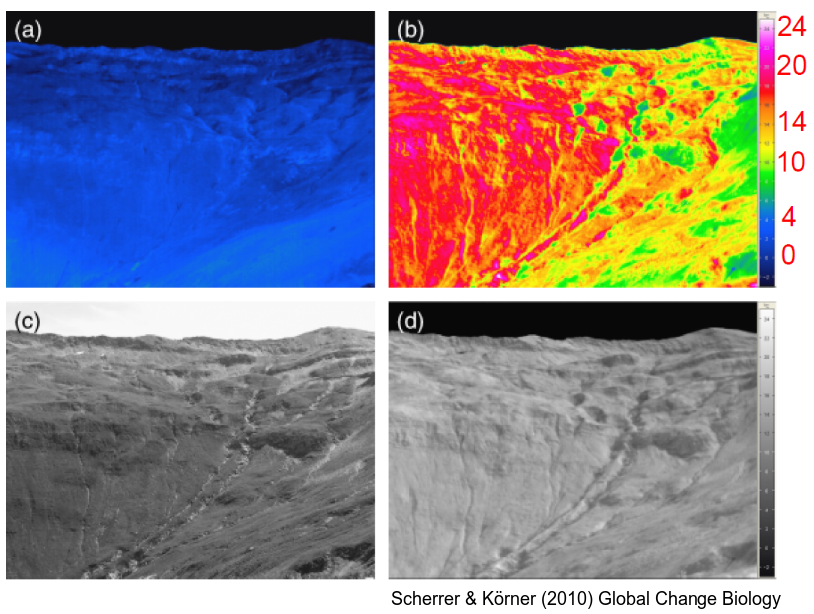
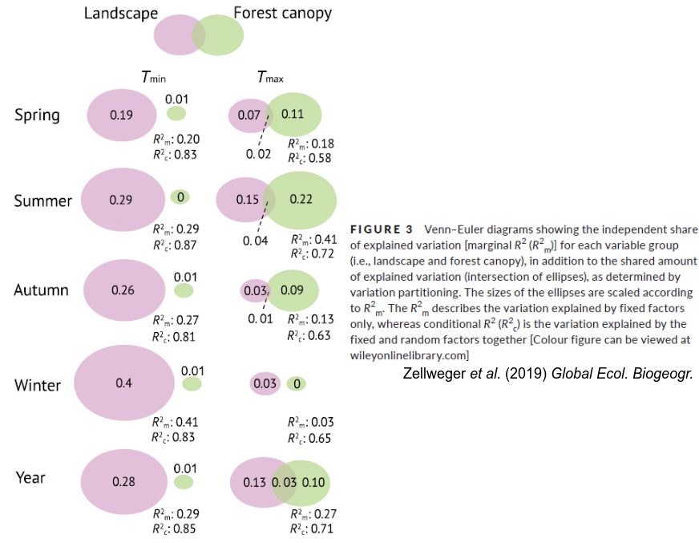

# Microclimate within ecosystems {#Microclim}
\chaptermark{Microclim}

## Definitions
### What is microclimate?

#### Microclimate 

As you may have experienced yourself, climatic conditions inside a forest can be very different from those outside it (as measured by a weather station in standard conditions, which are always in an open field above grass). These site-specific conditions are called the microclimate.

More formally, **microclimate is defined as fine-scale climate variations which are, at least temporarily, decoupled from the background atmosphere** (i.e., the macroclimate).

Microclimate should not be confused with **topoclimate**, which are variations in climate solely as a function of topographical features (elevation, slope, and aspect). Topoclimate is considered to vary at a larger scale than microclimates, and the variations occur higher above the ground.

As the variations in microclimate happen over days, or even hours, the correct term for “microclimate” would be “microweather” (and  “microclimate” is thus average “microweather”). 

#### Microclimate, topoclimate, mesoclimate and macroclimate

Up to now you’ve probably been mainly working with the macroclimate, which essentially shows the average climate over a large area (>50km) and up to a few kilometers above the ground. 

The tables below give an overview of the different spatial and temporal scales over which microclimate, topoclimate, mesoclimate and macroclimate vary, according to different authors. 
The **horizontal scale** shows the spatial range over which the climate varies parallel with the ground. For microclimate this varies from millimeters to about 100m, meaning that microclimate varies over a surface of ~1 hectare maximum. Once we are looking at variations at scales larger than this, we’re not looking at variations in microclimates anymore. For topoclimate this scale ranges from 100m to 10km, while meso- and macroclimate variations occur over even longer horizontal scales, up to hundreds of kilometers (see table).

The **vertical scale** shows the range over which climate varies perpendicular to the ground. For microclimate this is usually limited to 10m, or often even to 1m. For topoclimate we again look at larger vertical scales, from 5m to 1km, while mesoclimate varies over 500m to 4km, and macroclimate varies over 1-10km.

The **time scale** over which microclimate varies is of lesser relevance, as it mostly depends on the study that is performed. Some studies look at microclimate variations over several days, seasons or years.

```{r Micro1, fig.cap='Caption', out.width='80%', fig.asp=.75, fig.align='center',echo=FALSE, fig.show='hold'}

```


```{r Micro2, fig.cap='Caption', out.width='80%', fig.asp=.75, fig.align='center',echo=FALSE, fig.show='hold'}

```

### Microclimate in vegetation 

A few examples of different microclimates can be found in the following figures. Compare the different temperatures at the various locations in these ecosystems and plants. As you can see, it’s common to have variations in temperature from a few up to even 30°C over a small scale.


```{r Micro3, fig.cap='Caption', out.width='80%', fig.asp=.75, fig.align='center',echo=FALSE, fig.show='hold'}
knitr::include_graphics('figures/Figure103.png')
```

```{r Micro4, fig.cap='Caption', out.width='80%', fig.asp=.75, fig.align='center',echo=FALSE, fig.show='hold'}

```

```{r Micro5, fig.cap='Caption', out.width='100%', fig.asp=.75, fig.align='center',echo=FALSE, fig.show='hold'}

```


### Definitions: offsets, coupling and buffering

A temperature **offset** is an instantaneous difference between a reference temperature at a given time t0 and the focal temperature under study at the same time t0. The reference temperature is usually that of the macroclimate (eg. at a nearby weather station), while the focal temperature is that of the microclimate, measured in our ecosystem of study. Usually this offset is calculated as:

\begin{equation} 
 T_{offset} = T_{micro} - T_{macro}
  (\#eq:EqMicro1)
\end{equation} 

So a negative/positive offset means that the microclimate of study is cooler/warmer than the reference macroclimate.

In the following figure we find two different examples. In the example on the left side we see that the macroclimate fluctuates heavily (eg. between day- and nighttime, or between different seasons), while the temperature fluctuations of the microclimate inside the forest have a lower amplitude and lag behind a little. Plotting these temperatures against each other (figure bottom left) shows a typical linear pattern which often deviates from the 1:1 line, and can be described by the following equation:

\begin{equation} 
 T_{micro} = \beta_0 + \beta_1 T_{macro}
  (\#eq:EqMicro2)
\end{equation} 


When $β_1=1$ (and $β_0=0$) the microclimate temperature will equal the macroclimate temperature. This situation is called **coupling**, as the microclimate is perfectly coupled to the macroclimate, and is essentially the same. This is of course a rare situation, as usually $β_0>0$ and $0<β_1<1$ in reality. In that case we speak of **buffering**. On the other extreme end of the spectrum we have β1=0 in which the microclimate is completely independent from the macroclimate (“**decoupling**”). In a forest this is of course very rare, but it can happen, for example when we have a thick layer of snow in the forest, which will insulate the soil from the air above (right side figures).

```{r Micro6, fig.cap='Caption', out.width='80%', fig.asp=.75, fig.align='center',echo=FALSE, fig.show='hold'}

```


### Microclimatic variables

Although temperature forms an important component, microclimate is a broad concept, influencing all meteorological measurable variables, such as temperature, precipitation, solar radiation (light), wind, humidity, evaporation and soil water availability. Some of these variables are well-studied (eg. temperature and solar radiation in a forest), while for others there are still large knowledge gaps (eg. interception of rainfall in a forest).

### How to measure microclimate?

We already know the kind of sensors that are used in weather stations. Similar instruments are used to measure microclimate: thermocouples, wind sensors, tipping bucket precipitation sensors, etc. The figure below gives an overview of the types of sensors and their placement.

A few remarks:

Weather stations (left in figure) which are usually placed in open areas can be placed inside a forest as well. However, these are usually quite expensive.

Therefore we often use smaller sensors (right in figure), which are less accurate but can be used at a larger scale (eg. multiple sensors along a gradient). Depending on the objective, they can be put inside a tree, on the ground, inside bushes, in the soil, etc.

Sometimes it is even necessary to imitate the shape of the organism of study. For example, to study the effect of microclimate on frogs, temperature sensors can be placed in a green or brown plasticine frog figure.

More recently, thermal infrared images are also used to study the microclimate. For example by using an infrared sensor placed on a UAV.


```{r Micro7, fig.cap='Caption', out.width='100%', fig.asp=.75, fig.align='center',echo=FALSE, fig.show='hold'}
knitr::include_graphics('figures/Figure107.png')
```

#### Sensor examples

In the figure below we show a few examples of typical small sensors used to study microclimate:

On the left we see a device which contains 3 temperature sensors, to measure temperature in the air, at the soil surface and inside the soil. This device also measures soil moisture. 
Sensors like the iButtons and HOBO, originally used in the food shipping industry, also measure the temperature evolution at selected interval times over a given period. These are fairly cheap.


```{r Micro8, fig.cap='Caption', out.width='80%', fig.asp=.75, fig.align='center',echo=FALSE, fig.show='hold'}

```

#### Sensor effects

The measured microclimate is not only determined by the environment, it is also modified by the sensor itself. It’s important to know what the effects are of the sensor itself on its measured variables. In the figure below we show temperature measurements by a few different sensors at a few altitudes in a grassland and inside a forest. In the grassland, the sensors are exposed to the sun, while inside the forest they are shaded. The ultrafine thermocouple (black line) is considered to be the most precise and the least impacted, i.e. giving the true temperature. The iButtons perform the worst in the grassland, as they are relatively large (size of a 2 euro coin) and will absorb the solar radiation. We find temperature measurement errors of up to 15°C in this example, which are not due to microclimate but purely due to sensor effects. In contrast, inside the forest the sensors are shaded, so sensor effects on temperature are highly reduced.

```{r Micro9, fig.cap='Caption', out.width='100%', fig.asp=.75, fig.align='center',echo=FALSE, fig.show='hold'}

```

#### Shield effects

Likewise, the used radiation shield can have a large impact on the measurements, as shown in the figure below. Especially in open ecosystems, these shields can heat up and introduce errors in the temperature measurements.

```{r Micro10, fig.cap='Caption', out.width='100%', fig.asp=.75, fig.align='center',echo=FALSE, fig.show='hold'}

```

## Drivers

Which factors are responsible for creating microclimates? The figure below gives an overview. We will elaborate further on the most important of these factors in the following sections.

```{r Micro11, fig.cap='Caption', out.width='100%', fig.asp=.75, fig.align='center',echo=FALSE, fig.show='hold'}

```

We can split up these different drivers into factors that work horizontally and factors that work vertically, as illustrated in the figure below. Macroclimate works over large scales and is relatively coarse (eg. measurements of free-air temperature by weather stations), so when we place macroclimate measurements on a map and interpolate the results from different weather stations, the resolution will be quite low (1km x 1km).
On the other hand, microclimate works on a much finer scale. Horizontally, microclimate is mostly affected by elevation and terrain, land cover type (eg. forest, cropland, urban,…) and distance to water bodies. Maps showing horizontal spatial variations in microclimate will therefore be fine-grained. Important factors that influence microclimate vertically are vegetation characteristics, snow cover, and soil characteristics. Instead of studying the temperature in free air, we can look at a different layer, eg. the soil temperature. If we combine both horizontal and vertical factors, we can obtain fine-grained maps of the microclimate at various vertical layers (eg. detailed soil temperature maps).

In the following sections we will discuss five drivers of (forest) microclimate, from small to large spatial scale: soil, vegetation, topography, landscape and regional factors.

```{r Micro12, fig.cap='Caption', out.width='80%', fig.asp=.75, fig.align='center',echo=FALSE, fig.show='hold'}

```

### Soil

One of the most important factors that influence soil microclimate is the presence of litter on the forest floor (i.e. leaves). For example, in the following figure we can see how leaves reduce variations in soil temperature, compared to bare soil. The variations in leaf-covered plots will also lag behind the temperature variations in bare soil. Litter will also reduce the depth of frost penetration in the soil (by 40% in this example).


```{r Micro13, fig.cap='Caption', out.width='80%', fig.asp=.75, fig.align='center',echo=FALSE, fig.show='hold'}

```

**Snow** is also an important factor to determine soil microclimate. In the figure below you can see the difference between soil (0-5cm below ground) and air (2m above ground) temperature during two distinct seasons, globally. During the month of January, the insulating effect of snow cover can clearly be seen in the northern regions, as the soil is up to more than 15°C warmer than the air above. In contrast, tropical forests (S. America, C. Africa, S.E. Asia) will have lower soil temperatures throughout the year, compared to air temperature measured by weather stations outside the forest. Likewise, in northern summer, the soil in boreal needle leaf forests will also be cooler than air temperature outside the forest. 

```{r Micro14, fig.cap='Caption', out.width='100%', fig.asp=.75, fig.align='center',echo=FALSE, fig.show='hold'}

```

### Vegetation

#### Vegetation structure

Forests have a strong impact on microclimate. This impact is mostly determined by (1) the composition of the vegetation and (2) the vegetation structure. This is summarized in the figure below, showing the microclimate impacts of boreal, temperate and tropical forests, although the mechanisms illustrated are valid for all three forest types.

Wind speeds will be buffered by forests. Especially if the forest is rich in structure (eg. primary forests) there will be a strong reduction of wind speed. Planted forests, which are relatively poor in structure, will still reduce wind velocity, but much less than primary forests. This is one of the reasons why structure-rich forests will have higher buffering, or more negative offsets, during daytime.
Short-wave radiation will be more strongly reduced in denser forests, due to shading. Gaps in the canopy (eg. due to mortality) and seasonal foliage loss will allow more light to reach the forest floor.
In tropical regions epiphytes and lianas will play an important role. These plants grow upon other plants and enrich the forest with additional structure, further buffering the microclimate. Also in this case the contrast between primary and secondary forests will generate a different offset.

```{r Micro15, fig.cap='Caption', out.width='80%', fig.asp=.75, fig.align='center',echo=FALSE, fig.show='hold'}

```


#### Albedo

In the table below we find the albedo of various vegetation types and other surfaces. Dark green needle leaf forests will absorb more sunlight than fresh green grasslands, oak forests, or snow covered land.


\begin{center}
\captionof{table}{Table}
\label{table:albedoss}
```{r TableAlbedo, out.width='80%', fig.asp=.75, fig.align='center',echo=FALSE}

```
\end{center}

#### Height effects

Height location within the canopy above the forest floor will also determine microclimate, as summarized in the figures and video below. Here you can see how vertical vegetation structure affects temperature column evolution throughout the day.

**Video suggestion**: https://www.youtube.com/watch?v=7Iw4L0fFXjc

```{r Micro16, fig.cap='Caption', out.width='80%', fig.asp=.75, fig.align='center',echo=FALSE, fig.show='hold'}

```

#### Structural and compositional effects
The structure and composition of forests (eg. oak forest vs. birch forest) will highly impact the offset. In the figures below the offset of maximum summer temperature is given in function of several vegetation structural properties, such as canopy cover, tree height, canopy openness, etc.
We find that canopy cover has a strong negative effect on Tmax offset (i.e. the offsets will be more negative when canopy cover is higher). For the example below, this has a threshold of 93%, above which the effect stabilizes around -2.5°C (in summer during midday).
Canopy openness has a similar effect as canopy cover, but of course in the other direction.
Shade casting ability also has a negative effect on the offset, again up to a threshold.
Tree height and basal area don’t have a large impact on Tmax offset.


```{r Micro17, fig.cap='Caption', out.width='80%', fig.asp=.75, fig.align='center',echo=FALSE, fig.show='hold'}
knitr::include_graphics('figures/Figure1017.png')
```

#### Vegetation structure: mean effect

If we look at the effect of vegetation structure globally, we find that on average the maximum temperature in forests is 4.1° lower than outside, while the mean temperature 1.7° lower. On the other hand, the minimum temperature inside a forest is on average 1.1° warmer than outside. As can be seen in the histograms below, the variation is high. The differences are mainly explained by variations in forest structure and composition.

```{r Micro18, fig.cap='Caption', out.width='50%', fig.asp=.75, fig.align='center',echo=FALSE, fig.show='hold'}

```

```{r Micro19, fig.cap='Caption', out.width='75%', fig.asp=.75, fig.align='center',echo=FALSE, fig.show='hold'}

```

#### Vegetation structure: seasonal effects

In boreal and temperate forests, the different seasons will also have a strong impact. For example, in summer there will be a strongly negative offset in maximum air temperature, because the trees are in full leaf. For the forests in Europe this means that the maximum temperature inside the forest will be 2°C cooler on average, see figures below. The minimum air temperatures will be around 1°C higher throughout the year, and especially in summer. In wintertime the offsets will be smaller (ie. closer to zero) because most of our temperate forests are deciduous, so there will be less layers buffering the macroclimate from the microclimate.

```{r Micro20, fig.cap='Caption', out.width='100%', fig.asp=.75, fig.align='center',echo=FALSE, fig.show='hold'}

```

#### Vegetation structure: edge effects

The distance (from the inside) to the edge of the forest will also have an impact on the temperature offset, as can be seen in the figure below. The temperature offset will become more negative from the forest edge to the center. Also the impact of forest structure (dense vs. open) is apparent in these figures, as well as the mean regional temperature (represented by different colours). In general, forests in warmer countries will have stronger temperature offsets.

```{r Micro21, fig.cap='Caption', out.width='100%', fig.asp=.75, fig.align='center',echo=FALSE, fig.show='hold'}

```

#### Vegetation structure: species effects

Different species will also have different impacts on temperature offset, mostly due to shade casting variations. These shade casting variations depend on crown architectural properties, such as leaf angle, clumping, or leaf spectral properties. In the figure below the offset related to different species is shown, for a monoculture and mixtures of two or four species. 
```{r Micro22, fig.cap='Caption', out.width='100%', fig.asp=.75, fig.align='center',echo=FALSE, fig.show='hold'}

```

#### Precipitation in forests

Also precipitation is part of microclimate, because trees redistribute rainfall. Part of the incoming rainfall will stay on the leaves, while another part falls through. Another part will flow downward over the branches and trunk. Properties such as crown architecture and bark smoothness will have an impact on this redistribution. In the figure below we see an example of measured rain throughfall for a single birch tree, which varies strongly over the different locations under the tree. This causes strong gradients in soil moisture as a result.

```{r Micro23, fig.cap='Caption', out.width='100%', fig.asp=.75, fig.align='center',echo=FALSE, fig.show='hold'}

```

### Topography

Topography can have a strong impact on microclimate. This should not be confused with topoclimate. In the figure below we show thermal images during (a) nighttime and (b) daytime. The contrast in microclimate between the hot South-facing slope (left side of each photo) and the cooler East-facing slope (right side) is clear, with temperature variations up to 20°C during daytime. But also on the East-facing slope we can see local variations in microclimate, as some lumps on the slope are also facing South. So gigantic temperature differences can exist at distances of one meter, or even less. During nighttime, these differences disappear completely.

```{r Micro24, fig.cap='Caption', out.width='75%', fig.asp=.75, fig.align='center',echo=FALSE, fig.show='hold'}

```

In the figures below we find a similar example, but this time the slope contains a forest, which will further modify the local microclimate. Compare the difference in temperature between the forest and the grassland above. The typical pattern of decreasing temperature with increasing altitude (adiabatic lapse rate) is still present within each biome, but shifts strongly when moving from the montane forest to the alpine grassland, with an offset of almost 10°C.

```{r Micro25, fig.cap='Caption', out.width='100%', fig.asp=.75, fig.align='center',echo=FALSE, fig.show='hold'}

```

In the figure below we see how topographic position (ranging from valleys to mountain ridges) affects temperature offsets in a forest. During summer this impact is insignificant, but in winter the temperature offset will be positive in the forests located in valleys or on ridges.

```{r Micro26, fig.cap='Caption', out.width='100%', fig.asp=.75, fig.align='center',echo=FALSE, fig.show='hold'}

```

### Landscape

#### Landscape vs. vegetation structure

In the figure below we compare how strong landscape factors vs. forest canopy factors impact minimum and maximum temperature offsets throughout a typical year, for a temperate deciduous forest. Landscape factors include forest cover, distance to the sea, grasslands, topographic position, etc.

We see that **forest canopy** has a strong impact on Tmax offset, being responsible for 22% of the variation in microclimate inside a forest. However, during wintertime this impact of forest canopy is reduced to zero for deciduous forests, as there will be no leaves in the canopy. Similarly, the share of forest canopy in winter Tmin offset variation is very small (~1%).

On the other hand, **landscape factors** explain a large (29%) share of the variation in summertime Tmin offsets, and less so for summertime Tmax offset (15%). However, the strongest impact of landscape happens during wintertime, when it explains 40% of the variation in observed Tmin offset.

```{r Micro27, fig.cap='Caption', out.width='100%', fig.asp=.75, fig.align='center',echo=FALSE, fig.show='hold'}

```

#### Buffering in hedgerows

Another factor that strongly determines microclimate, is the existence of hedgerows in the landscape. In the figures below we show temperature offsets in function of distance to the ecotone, where negative distance values represent locations inside the forest, and positive values represent locations inside the hedgerow. Interestingly, Tmax offsets will be higher (less negative) at the point where the hedgerow is connected to the forest, compared to the other locations. This point has an increased exposure to sunlight, while still being buffered from winds, leading to higher temperatures. For Tmin offsets we find warmer (compared to outside) temperatures inside the forest and, to a lesser degree, in the hedgerow.

```{r Micro28, fig.cap='Caption', out.width='100%', fig.asp=.75, fig.align='center',echo=FALSE, fig.show='hold'}

```

```{r Micro29, fig.cap='Caption', out.width='100%', fig.asp=.75, fig.align='center',echo=FALSE, fig.show='hold'}

```

These hedgerow buffering factors also depend on the structure of the hedgerow, where for example hedgerow width, canopy cover and tree height all have an impact on Tmax offset (see figure below).

```{r Micro30, fig.cap='Caption', out.width='100%', fig.asp=.75, fig.align='center',echo=FALSE, fig.show='hold'}

```

### Regional drivers

#### Macroclimate

A final regional factor which will influence microclimate is the macroclimate. In the figure below we show how the temperature outside the forest will impact the temperature buffering of the forest. Increasing outside temperatures will cause more negative Tmax offsets. On the other hand, decreasing outside temperatures will lead to increased (“more positive”) Tmin offsets in the forest. For example, if the temperature outside is -10°C, it will be 3°C warmer inside the forest.

```{r Micro31, fig.cap='Caption', out.width='40%', fig.asp=.75, fig.align='center',echo=FALSE, fig.show='hold'}

```

#### Distance to coast

The distance to the coast affects Tmin and Tmax offsets, as shown in the figures below.

```{r Micro32, fig.cap='Caption', out.width='100%', fig.asp=.75, fig.align='center',echo=FALSE, fig.show='hold'}

```

## Impacts on biodiversity and ecosystem functioning

The microclimate inside a forest can have an important impact on biodiversity and ecosystem functioning (eg. carbon, water, nutrient cycling).

### Organism’s views on microclimate

The way we quantify microclimate depends on the organism of study. For example, an elephant and a woodlice will have a very different perception of “micro”. Scale matters, in both space and time. In the next subsections we’ll see a few different examples, ranging from small to large scale.

#### Leaf miners

Microclimate is experienced at the millimeter scale by arthropods. These insects will change the leaf transpiration to create an optimal temperature for themselves. Some of them feed on phloem to increase the leaf transpiration, in order to cool down the leaf to their optimal temperature. Others pierce the leaf tissue to reduce leaf transpiration and thereby increase leaf temperature.

```{r Micro33, fig.cap='Caption', out.width='100%', fig.asp=.75, fig.align='center',echo=FALSE, fig.show='hold'}

```

```{r Micro34, fig.cap='Caption', out.width='50%', fig.asp=.75, fig.align='center',echo=FALSE, fig.show='hold'}

```

#### Plants

Thermophilization is an index which quantifies how strongly the species in a forest thrive in warm conditions. Positive values mean that the amount of heat-loving species is increasing in the forest, while the amount of cold-loving species decreases, and vice versa for negative values of this index. There seems to be no relation between changes in macroclimate Tmax and the thermophilization. However, there’s a positive correlation between thermophilization and changes in microclimate Tmax. These microclimate changes are due to structural changes (eg. a forest growing more dense). In this example we look at microclimate at the scale a few meters.

```{r Micro35, fig.cap='Caption', out.width='50%', fig.asp=.75, fig.align='center',echo=FALSE, fig.show='hold'}

```

#### Arboreal frogs

In the example below we also look at microclimate variations at the scale of a few meters. In the tropics there are many frog species who live inside trees (“arboreal frogs”). At high altitudes (eg. in the mountains) these frogs will be high in the trees, while at low altitudes it will be too warm for them, and the frogs prefer to live lower in the trees.

```{r Micro36, fig.cap='Caption', out.width='100%', fig.asp=.75, fig.align='center',echo=FALSE, fig.show='hold'}

```

#### Moose

Similarly, moose aren’t very tolerant to high temperatures and will prefer locations in dense, cooler, parts of the forest during the warm part of the day.

```{r Micro37, fig.cap='Caption', out.width='100%', fig.asp=.75, fig.align='center',echo=FALSE, fig.show='hold'}

```

### Impacts on ecosystem function

Many ecosystem functions and services are affected by microclimate. In this section we just give two examples.

#### Carbon: an ecosystem service

In the figures below we show how different carbon pools in the forest vary with the distance to the forest edge. In general, carbon stocks will be higher near the edge of the forest than in the center, mostly due to the warmer microclimate near the edge. Also there will be a larger influx of nutrients from surrounding agriculture at the edges. If we take this into account when quantifying the European carbon stocks, we find an increase of 183 TgC with respect to calculations that don’t take the edge effect into account. This corresponds to 1 million hectare of extra (core) forest.

```{r Micro38, fig.cap='Caption', out.width='100%', fig.asp=.75, fig.align='center',echo=FALSE, fig.show='hold'}

```

#### Ticks: an ecosystem disservice

Ticks prefer cooler, more humid microclimates. We find more ticks in a structure-rich forest, such as oak forests with a high shrub cover, as these forests will be cooler. Also tick hosts such as mice and deer will find more food and shelter in oak forests. Clearing the shrub cover will therefore reduce the tick abundance in these forests.

```{r Micro39, fig.cap='Caption', out.width='100%', fig.asp=.75, fig.align='center',echo=FALSE, fig.show='hold'}

```

## Microclimate and climate change

### Microclimate and climate change

How will climate change influence microclimate? We’ve seen that microclimate is directly affected by (macroclimate) temperature, snow and precipitation, and indirectly by changes in tree canopy cover and composition. Climate change will change forest structure and composition, and therefore will change the microclimate as well. Also phenology will shift due to climate change, further influencing microclimate. Feedbacks between the microclimate and macroclimate (eg. due to change in carbon stocks) make the story even more complex. The figure below gives an overview of this complexity.

```{r Micro40, fig.cap='Caption', out.width='80%', fig.asp=.75, fig.align='center',echo=FALSE, fig.show='hold'}

```

### Tree vs. understorey phenology

Trees are slightly more sensitive to global warming than the other species growing in the forest, influencing leaf phenology. Trees will start growing leaves 4-5 days earlier per °C increase in temperature, while for other species this effect will only be 2-3 days. This means that trees will start to shade other plants earlier in the season, with increasing temperature. This in turn will affect the growth and carbon cycle of the forest vegetation. Projected into the future this means that, depending on the scenario, 30-65% less carbon will be gained by the herbaceous layer during spring, compared with today. It is possible that the tree layer will gain more carbon, due to an earlier leaf onset and corresponding photosynthesis, thereby possibly compensating the decrease of carbon uptake of the herbaceous layer.

```{r Micro41, fig.cap='Caption', out.width='100%', fig.asp=.75, fig.align='center',echo=FALSE, fig.show='hold'}

```

### Forest offsets

How will microclimate offsets evolve with climate change? As we learned before, these offsets strongly depend on the macroclimate. In the figure below the current mean temperature buffering is given globally. In the tropical forests we see a negative offset. 

```{r Micro42, fig.cap='Caption', out.width='100%', fig.asp=.75, fig.align='center',echo=FALSE, fig.show='hold'}

```

In the figure below we show the difference in offset between now and a future climate scenario, i.e. the colours give the future minus the current offset. It is clear that the offsets of forests will become more negative globally. So there will be a higher degree of decoupling between the inside and outside temperature of a forest. This scenario only looks at the impact of a changing macroclimate, so it doesn’t take into account changes in forest structure and composition.

```{r Micro43, fig.cap='Caption', out.width='100%', fig.asp=.75, fig.align='center',echo=FALSE, fig.show='hold'}

```

